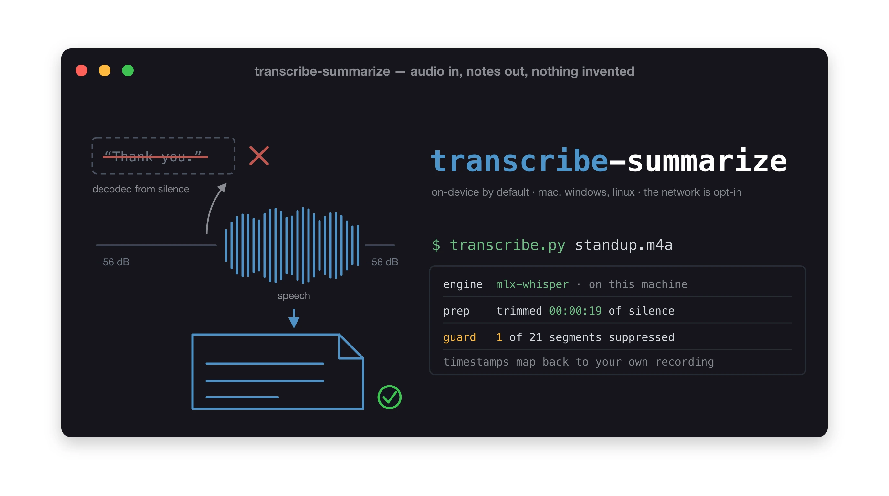

# transcribe-summarize



<!-- banner.png is the same image for anywhere WebP is not supported; images/README.md explains the set -->

Transcribe audio on your own machine, on macOS, Windows or Linux. Optionally turn
the result into meeting notes and a PDF.

Nothing leaves your computer unless you name a network backend in the command,
and when you do, the tool tells you what it is about to send and what it will
cost before it sends it.

## What it does

| in | what happens | out |
|---|---|---|
| **audio** — `.mp3`, `.m4a`, `.wav`, `.flac`, `.opus` | normalise, trim silence, decode, filter inventions | transcript `.md` + `.srt` + `.json` |
| **video** — `.mp4`, `.mov`, `.mkv`, `.webm` | ffmpeg takes the audio track; the video is ignored | same as above |
| **an existing transcript** — `.vtt`, `.srt` from Teams or Zoom | cues rejoined, timecodes dropped, speakers attributed | readable `.md`, no transcription at all |
| any of the above | you review, then Claude writes it up | meeting notes `.md` + `.pdf` |

A Teams or Zoom download is an `.mp4` and works as-is — you do not extract the
audio first. And if the platform already transcribed the meeting, skip the audio
entirely: `normalise_transcript.py` turns the `.vtt` into prose and the notes step
is identical.

```bash
# transcribing needs a backend, and the backend comes from --with
uv run --with 'mlx-whisper>=0.4.2' --script scripts/transcribe.py meeting.mp4

# everything else is stdlib and runs directly
./scripts/normalise_transcript.py meeting.vtt          # an existing transcript
./scripts/notes_check.py notes.md                      # check the notes register
./scripts/render_pdf.py notes.md                       # notes -> PDF
```

**Only `transcribe.py` needs `--with`.** It declares no dependencies of its own, so
installing this skill does not drag in every engine — the backend you pick brings
its own library and only when you pick it. Run it without one and it exits 1 with
the exact command to use. The `--with` spec per backend is in the table below.

A file with **no** audio track — a muted screen recording — is refused before any
upload is offered, so it is never sent or billed.

**Sovereign by default.** The local path never touches the network. Whisper runs
on your machine — `mlx-whisper` on Apple Silicon, `faster-whisper` elsewhere —
and `--backend auto` has no code path to a hosted API, asserted across twelve
platform combinations. Hosted backends exist and are reachable only by naming one
in that invocation, after a disclosure of what will be sent and what it costs.

## What it does NOT do

Worth being explicit, because several of these are things people assume:

- **It does not verify anything.** Output is a draft. Machine transcription is
  confidently wrong in ways no threshold catches — measured here, `large-v3`
  silently dropped a speaker correcting a figure, and *every* backend heard
  "board pack" as "board packs up". A human has to read it.
- **It does not remove filler by transcribing.** No model does — local or hosted.
  Measured: mlx-whisper, faster-whisper, Parakeet and OpenAI all returned the
  same "um"s. Filler comes out at the **notes** step, so a raw transcript is
  verbatim and uncleaned.
- **It does not identify who is speaking**, except on `--backend elevenlabs`,
  and even there you get `speaker_0` / `speaker_1`, not names. Attendees are
  something you tell it.
- **It does not translate**, do real-time streaming, or handle multi-track audio.
- **It does not edit your words.** The transcript is verbatim; judgement happens
  in the notes, under a fixed register.
- **It does not make a recording lawful.** Keeping provenance out of a document
  changes what the document says, not what happened. Consent is yours to obtain.
- **The quality guard is not equally strong everywhere.** Parakeet and ElevenLabs
  return no Whisper metrics, so only the silence and repetition rules apply.

## Why this exists

The obvious tools either only run on one platform or quietly upload your audio.
The specific failure worth avoiding is not "uses an API" — it is *uploaded the
audio and you could not tell*.

Beyond that, two findings from a day of measurement against real recordings shape
the whole design:

**Whisper invents speech over silence, and a bigger model does not save you.** On
a call with about 40 seconds of joining silence at −69 dB, `large-v3` emitted an
18-second segment consisting of one word repeated 55 times, plus a spurious
"Thank you." Both were written to the output as if real. Both were detectable
from numbers Whisper already returns:

| metric | on the hallucination | Whisper's own threshold |
|---|---|---|
| `compression_ratio` | 17.38 | 2.4 |
| `no_speech_prob` | 0.708 and 0.923 | 0.6 |

This tool filters them out and keeps them in the JSON sidecar with the reason, so
a gap in the transcript is always answerable.

**Cleaning the audio beat choosing a model.** Same file, same model, same flags —
normalising and silence-trimming took invented segments from 2 to 0 and fixed a
word that both `large-v3` and `turbo` had decoded wrong on the raw audio. It costs
nothing in throughput. So it is on by default, done with ffmpeg, on every
platform.

## Install

Three ways in, depending on what you want.

**As a standalone plugin** — this repo on its own:

```bash
claude plugin marketplace add kevin-burns/transcribe-summarize
claude plugin install transcribe-summarize@transcribe-summarize
```

**As part of the collection** — all the skills, one plugin:

```bash
claude plugin marketplace add kevin-burns/claude-skills
claude plugin install claude-skills@kevin-burns
```

**By hand**, if you would rather not use a marketplace: copy the `transcribe-summarize/`
directory into `~/.claude/skills/`. Everything the skill needs is inside it.

### Check it actually loaded

Do not take the install command's word for it. This repo has shipped plugin manifests that
failed **silently** — registering cleanly and listing zero plugins. Verify:

```bash
claude plugin details transcribe-summarize@transcribe-summarize
```

You want `Skills (1)  transcribe-summarize` under **Component inventory**. Zero means the
manifest registered and the skill did not load.

**A trap worth knowing:** `claude --safe-mode` disables plugin-provided skills, so a skill
installed this way will not appear in a safe-mode session. That is not a broken install.

### Prerequisite

`ffmpeg` and `ffprobe` on PATH:

```bash
brew install ffmpeg                  # macOS
winget install Gyan.FFmpeg           # Windows
sudo apt install ffmpeg              # Debian/Ubuntu
```

Everything else is Python standard library. Each transcription backend brings its
own dependency, and only when you choose it, so installing this does not drag in
every engine.

## Use

```bash
# Apple Silicon
uv run --with 'mlx-whisper>=0.4.2' --script scripts/transcribe.py meeting.m4a

# Windows / Linux
uv run --with 'faster-whisper>=1.2' --script scripts/transcribe.py meeting.m4a \
    --backend faster-whisper
```

You get:

```
meeting.md                      the transcript, with [hh:mm:ss] anchors
meeting-artifacts/
    meeting.srt                 subtitles
    meeting.json                every segment, including the suppressed ones
    meeting.run.json            backend, model, trim offsets, guard tally
```

Timestamps are on **your** file's clock. Trimming shortens the audio while it is
being decoded; the offsets are mapped back before anything is written, so the
`.srt` still lines up with the recording on your disk.

Useful flags:

```
--prompt 'Terragrunt, EKS'        bias the decoder toward known jargon
--replace 'north wind=Northwind'      fix a known misrecognition, repeatable
--guard mark                      keep suspect segments, flagged, instead of dropping
--no-trim / --no-normalise        turn off audio preparation
--keep-intermediate               keep the prepared wav to listen to
--dry-run                         say what would happen; decode nothing
```

## Backends

| backend | platform | quality guard | network |
|---|---|---|---|
| `mlx-whisper` | Apple Silicon only | full | no |
| `faster-whisper` | mac / Windows / Linux | full | no |
| `parakeet` | mac / Windows / Linux | **repetition rule only** | no |
| `groq` | any | full | **yes** |
| `openai` | any | full | **yes** |
| `elevenlabs` (Scribe) | any | partial | **yes** |

`--backend auto` picks `mlx-whisper` on Apple Silicon and `faster-whisper`
elsewhere. **It can never pick a network backend** — not as a default, not as a
fallback when a local backend fails. There is no code path from `auto` to one.

The guard's strong rules read Whisper decoder metrics. `faster-whisper`, Groq and
OpenAI all return them, so the guard is literally the same code. **Parakeet
returns none of them** and falls back to a repetition heuristic; the tool prints
that fact on every run rather than letting you infer it from a clean-looking
transcript. Parakeet has also never been run against a real NeMo install — see
`references/backends.md`.

## What these backends actually did

Measured on 2026-09-04, Apple M1 Pro / 16 GB / macOS 26.6.2 / ffmpeg 9.0.1, on a
**real 2 min 19 s recording made with a laptop's built-in microphone** — one
speaker, a real room, no processing applied before the tool saw it. Model weights
were already cached, so no download time is included. Silence-trimming removed
19 s (14%) before decoding, identically for every backend.

| backend | model | decode | accuracy | notable failure |
|---|---|---|---|---|
| `openai` | whisper-1 | 9.8 s | **11 / 12** | — |
| `elevenlabs` | scribe_v2 | 20 s | **10 / 12** | "obviously" → "absolute" |
| `mlx-whisper` | **large-v3-turbo** (now default) | 13.8 s | 9 / 12 | "Terragrunt" → "terror grunt" |
| `faster-whisper` | large-v3 | 53.9 s | 9 / 12 | "Terragrunt", "the AKS ones" |
| `parakeet` | parakeet-tdt-0.6b-v3 | 12.5 s | 8 / 12 | "Raghunathan", "Terragrunt" |
| `mlx-whisper` | large-v3 (was default) | 21.5 s | 8 / 12 | **dropped a spoken self-correction** |

The twelve checks are specific things in the audio that are known to be hard:
technical proper nouns (Terragrunt, EKS/AKS, Cloudflare Access, Postgres), an
invented surname, four figures and a date, two spoken self-corrections, and one
near-homophone pair (99.95% versus 99.5%).

### What the numbers actually say

**The old default was the worst Whisper result here, so the default changed.**
`large-v3` scored below `large-v3-turbo` while taking 56% longer, and its failure
was the serious kind:
the speaker corrected himself mid-sentence — "oh, actually, correction, that was
99.95%" — and `large-v3` **dropped the correction entirely**, rendering the
sentence as "99.5%, not Not 99.5%". Every other backend kept it. In a document
meant to record what was said, silently losing a speaker's correction of a figure
is the worst available failure.

**Both Whisper backends therefore now default to `turbo`.** `--model large-v3` is
still there if you want it.

One recording is not a benchmark, and this does not establish that turbo beats
large-v3 in general. It does mean the common claim that large-v3 is worth its
extra time on accented English is **not supported by the only real measurement
this project has**, which is enough to stop making it the thing people pay for by
default. If large-v3 is better on your audio, measure it and use it.

(`faster-whisper` resolves `turbo` to `mobiuslabsgmbh/faster-whisper-large-v3-turbo`
rather than a Systran repo — a different publisher from its other short names.
Measured at 50.7 s here, barely faster than its large-v3, because the bottleneck
is CPU inference rather than model size.)

**Nothing recovered "board pack"** — all six heard "board packs up". Some errors
are in the audio, not the model.

**Scribe was the best of the non-OpenAI backends**, and the only one besides
`large-v3` and OpenAI to get "Terragrunt". It also transcribed the speaker's
misread *and* the correction that followed it — "not nineteen nine point five…
oh actually correction, that was ninety-nine point nine five" — where `large-v3`
dropped the correction entirely. It produced the fewest, longest segments (10,
against 15–25), which reads better as prose and matters if anything downstream
assumes a segment is a fixed unit.

Its diarization returned one speaker here, correctly: this is a single-speaker
recording. Two voices were separated in a dedicated live test.

**Proper nouns are what `--prompt` and `--replace` exist for**, and both work:

```bash
--prompt 'Terragrunt, EKS, AKS, Cloudflare Access'    # recovered Terragrunt on turbo
--replace 'terror grunt=Terragrunt'                   # deterministic, reported "2 correction(s)"
```

**Speed ordering held from the synthetic run**: `faster-whisper` on CPU was
roughly 4× slower than `mlx-whisper` on the Apple GPU. On a CUDA machine that
ordering would likely differ, and was not measured here.

### One boundary difference worth knowing about

Whisper's segment end times hug the speech. Parakeet's do not: on this file its
final segment ran to **48.48 s** on audio whose speech stopped at **40.79 s** —
nearly eight seconds of overrun to near end-of-file.

That matters because the silence guard compares segments against measured silent
spans. An earlier version of the rule asked whether a segment's *midpoint* fell
inside a silence, which is fine for Whisper and wrong for Parakeet: the
overrunning segment's midpoint landed in the trailing silence and **real speech
was suppressed**. A guard that deletes genuine content is worse than one that
misses an invention.

Two independent fixes came out of it:

- **The rule now requires containment** — the segment must lie wholly inside one
  silent span. A segment that starts before the silence cannot have been decoded
  from it.
- **Parakeet now decodes with beam search rather than greedy.** Its maintainer
  attributes the timestamp anomaly to greedy TDT decoding
  ([parakeet-mlx#43](https://github.com/senstella/parakeet-mlx/issues/43)), and
  the same behaviour appears in another TDT implementation on the same weights
  ([FluidAudio#128](https://github.com/FluidInference/FluidAudio/issues/128)).
  Measured here: the overrun fell from **+7.69 s to +0.73 s**, and decoding got
  slightly *faster*. Details in `references/backends.md`.

## Cost, if you use a network backend

Per hour of audio, from each provider's published pricing (verified 2026-09-04):

| backend | model | $/hour | diarizes |
|---|---|---|---|
| `groq` | whisper-large-v3-turbo | **0.04** | no |
| `groq` | whisper-large-v3 | 0.111 | no |
| `elevenlabs` | scribe_v2 | 0.22 | **yes, up to 32** |
| `openai` | whisper-1 | 0.36 | no |

Silence-trimming happens *before* upload, so you are billed for the trimmed
duration — measured at 12 s sent from a 47 s file. The disclosure block prints
"up to" for that reason.

A model with no published rate yields no estimate, and the disclosure says
"unknown for this model". That means *cannot estimate*, never *free*.

## Sending audio to an API

Only when you ask for it by name. First you get this, and a prompt:

```
  ── this will send your audio over the network ──────────────
  provider : groq
  endpoint : api.groq.com
  file     : meeting.m4a  (3.1 MB)
  duration : 00:41:07
  model    : whisper-large-v3
  cost     : ~$0.076
  ────────────────────────────────────────────────────────────
```

Silence is trimmed *before* uploading, so it cuts the bill as well as the
hallucinations — on a 47-second call with a silent head, 12 seconds were
actually sent. The block says "up to" because it has to print before any work
happens. Keys are read from `GROQ_API_KEY` or `OPENAI_API_KEY` only —
never a flag, never printed, never written into the run manifest. In a
non-interactive session an unconfirmed upload is refused rather than assumed.

## It produces a draft, not a verified record

Machine transcription is confidently wrong in ways no threshold catches.
Measured here: `large-v3` silently dropped a speaker correcting a figure, and
**every** backend heard "board pack" as "board packs up". Both read fluently. The
quality guard catches text invented over silence; it cannot catch a plausible
mis-hearing.

So every transcript ends with a **"Worth checking"** section — ranked timestamps
where a listen-back is most likely to pay off, chosen from the decoder's own
least-confident moments and anything containing figures:

```
## Worth checking

- **[00:01:27]** contains figures — our uptime figure last quarter was 99.5%...
- **[00:01:37]** contains figures — correction, that was 99.95%, not 99.5%...
```

Those are hints, not errors. Names, figures and dates are what to verify: first
to degrade, most expensive to get wrong.

The `.md` is the source of truth. Correct it by hand (or re-run with `--replace`),
then rebuild the PDF without re-transcribing:

```bash
./scripts/notes_check.py notes.md      # run this again after every edit
./scripts/render_pdf.py  notes.md
```

Re-run the checker after editing — hand-editing is exactly when a provenance leak
or an inferred "next steps" line gets introduced.

## Meeting notes

The notes document is a **factual summary and nothing else**: what was said,
under topic headings. No analysis, no implications, no "next steps", no "what the
call did not cover". It reads as a write-up by someone who was in the room, and
it never mentions a recording, a transcript, or that a machine was involved.

**It cannot tell you who was speaking.** No Whisper backend returns a speaker
field — not mlx-whisper, faster-whisper, Groq or OpenAI. Diarisation would mean a
separate gated model and a multi-GB torch install, and it would still only produce
`Speaker 1` / `Speaker 2`, which this register forbids as a decoder artefact. So
the attendees, the meeting date and the title are supplied by you:

```bash
./scripts/summarize.py transcript.md --backend groq \
    --title 'Q3 platform planning' --date 2026-09-01 \
    --attendee 'A. Okonkwo' --attendee 'M. Reyes'
```

Without `--attendee` the notes are written with no attribution at all rather than
a guessed one. Without `--date` it warns you that it is stamping today.

Those rules live in one file, `references/notes-register.md`, and they are
enforced rather than hoped for:

```bash
./scripts/notes_check.py notes.md      # exit 1 and file:line for every violation
./scripts/render_pdf.py notes.md       # headless Chrome/Chromium/Edge
```

Run the checker on the PDF too. A leak that only exists in the rendered file
still counts.

Guidance and analysis are welcome — *after* the notes and outside the document.

**A limit, stated plainly:** keeping provenance out of a document changes what the
document says, not what happened. Recording a call without consent is a criminal
offence in some jurisdictions — in Germany, StGB §201 — and a carefully worded
write-up is not a defence to it. Getting consent is your responsibility. This tool
does not provide legal cover and nothing here should be read as suggesting it
does.

## Security posture

Audited with `bandit`: **0 high, 0 medium, 6 low** across the shipped code.
Nothing is suppressed with `#nosec` — the medium findings were fixed, not
annotated.

- **`B310` (`urlopen`) — removed.** `urlopen` dispatches on the URL's scheme, so
  it will open `file://` and hand back a local file. That turns an API client
  into a file reader the moment someone makes the endpoint configurable, which
  a self-hosted or Azure-style OpenAI-compatible host would prompt. Validating
  the scheme first would work but leaves the capability in place behind a check
  someone can move. Both network paths now use `http.client.HTTPSConnection`,
  which speaks no other scheme: there is no URL to mis-parse and no plaintext
  fallback that could send the `Authorization` header in clear. A test asserts,
  on the AST, that `urlopen` has not come back.
- **`B404` / `B603` (6 low) — shelling out to ffmpeg and a browser.** There is no
  `shell=True`, no `os.system`, no `os.popen`; every call is list-form argv, so
  shell injection is not reachable. The only user values interpolated into an
  ffmpeg filter string are `--silence-threshold` and `--min-silence`, both
  `type=float` at the argparse boundary, plus trim offsets formatted `:.6f` from
  parsed output. A string cannot get through. These findings are informational —
  bandit flags the import and the safe call form to prompt exactly this audit.

Key handling: read from the environment only, never a CLI flag (a flag lands in
shell history and process listings), never echoed, never written to the run
manifest or any log. Errors are raised `from None`, so the chained exception —
which holds the request and its `Authorization` header — is not attached. Tests
assert a decoy key reaches the header and appears in no error message.

`ruff` runs with `S` (bandit's ruleset) disabled repo-wide, because 206 of the
findings in this skill's tests are `B101` (`assert`), the correct construct
there. Bandit is run separately over `scripts/`, where it earns its keep.

## Development

```bash
uv run --with pytest python -m pytest tests/ -q
cd evals && uv run python grade.py
python3 fixtures/make_fixtures.py       # synthesised audio, never committed
```

Fixtures are generated, not committed: this repository is public, and audio — or
anything derived from a real recording — does not belong in it.
